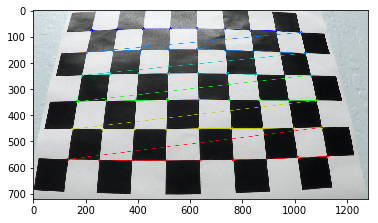
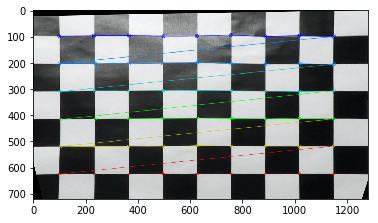
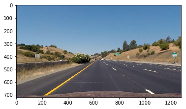
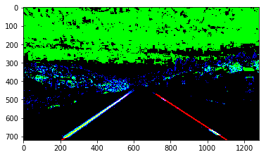
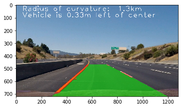

# Advanced Lane Finding Project

The goals / steps of this project are the following:

* Compute the camera calibration matrix and distortion coefficients given a set of chessboard images.
* Apply a distortion correction to raw images.
* Use color transforms, gradients, etc., to create a thresholded binary image.
* Apply a perspective transform to rectify binary image ("birds-eye view").
* Detect lane pixels and fit to find the lane boundary.
* Determine the curvature of the lane and vehicle position with respect to center.
* Warp the detected lane boundaries back onto the original image.
* Output visual display of the lane boundaries and numerical estimation of lane curvature and vehicle position.

[//]: # (Image References)

[image1]: ./examples/undistort_output.png "Undistorted"
[image2]: ./test_images/test1.jpg "Road Transformed"
[image3]: ./examples/binary_combo_example.jpg "Binary Example"
[image4]: ./examples/warped_straight_lines.jpg "Warp Example"
[image5]: ./examples/color_fit_lines.jpg "Fit Visual"
[image6]: ./examples/example_output.jpg "Output"
[video1]: ./project_video.mp4 "Video"

## [Rubric](https://review.udacity.com/#!/rubrics/571/view) Points

Here I will consider the rubric points individually and describe how I addressed each point in my implementation.  

---

### Writeup / README

#### 1. Provide a Writeup / README that includes all the rubric points and how you addressed each one.  You can submit your writeup as markdown or pdf. 

You're reading it!

### Camera Calibration

#### 1. Briefly state how you computed the camera matrix and distortion coefficients. Provide an example of a distortion corrected calibration image.

The code for this step is contained in the first section of the IPython notebook located in "assignment.py

I start by preparing "object points", which will be the (x, y, z) coordinates of the chessboard corners in the world. Here I am assuming the chessboard is fixed on the (x, y) plane at z=0, such that the object points are the same for each calibration image.  Thus, `objp` is just a replicated array of coordinates, and `objpoints` will be appended with a copy of it every time I successfully detect all chessboard corners in a test image.  `imgpoints` will be appended with the (x, y) pixel position of each of the corners in the image plane with each successful chessboard detection.  

I then used the output `objpoints` and `imgpoints` to compute the camera calibration and distortion coefficients using the `cv2.calibrateCamera()` function.  I applied this distortion correction to the test image using the `cv2.undistort()` function and obtained this result: 

**Original**


**Unwarped**



### Pipeline (single images)

#### 1. Provide an example of a distortion-corrected image.

To demonstrate this step, I will describe how I apply the distortion correction to one of the test images like this one:


#### 2. Describe how (and identify where in your code) you used color transforms, gradients or other methods to create a thresholded binary image.  Provide an example of a binary image result.

I used a combination of color and gradient thresholds to generate a binary image in the `pipeline()` function within cell 10, lines 98 - 115.  Here's an example of my output for this step:

Channels:
* R: lanes
* G: S Channel threshold of the HLS
* B: Gradient threshold binary.



#### 3. Describe how (and identify where in your code) you performed a perspective transform and provide an example of a transformed image.

The code for my perspective transform is also within `pipeline()`, line 138

The points come from the functions:

```python
def get_src_pts(img):
    h, w = img.shape
    vert=[]
    #upper_left
    vert.append([w/2 -70, h/2 +110])
    #lower_left
    vert.append([210, h-1])
    #upper_right
    vert.append([w/2 +80, h/2 +110])
    #lower_right
    vert.append([w-175, h-1])
    return np.floor(vert).astype(int)

def get_dst_pts(img):
    h, w = img.shape
    vert=[]
    #upper_left
    vert.append([300, 0])
    #lower_left
    vert.append([300, h-1])
    #upper_right
    vert.append([w-300, 0])
    #lower_right
    vert.append([w-1-300, h-1])
    
    return np.floor(vert).astype(int)
```

I verified that my perspective transform was working as expected by drawing the `src` and `dst` points onto a test image and then warping the image to confirm everything is straight.


#### 4. Describe how (and identify where in your code) you identified lane-line pixels and fit their positions with a polynomial?

Then I wrote `fit_line()` in cell 12 to fit the lane lines pixels with a 2nd order polynomial kinda like this:

![alt text][image5]

#### 5. Describe how (and identify where in your code) you calculated the radius of curvature of the lane and the position of the vehicle with respect to center.

I did this in cell 12 of the notebook.

`get_curve()` takes a poly1d object in pixel space and converts it to world space (meters) so that we can get the curve and offsets.

`get_curve()` takes a poly1d object and evaluates the curve of the line by calculating the derivative at the evaluation point.

`get_offset()` takes 2 poly1d objects and evaluates where the center of the lines are and how far the camera is to the left or right of that center.

#### 6. Provide an example image of your result plotted back down onto the road such that the lane area is identified clearly.

I implemented this step in lines # through # in my code in `yet_another_file.py` in the function `map_lane()`.  Here is an example of my result on a test image:



---

### Pipeline (video)

#### 1. Provide a link to your final video output.  Your pipeline should perform reasonably well on the entire project video (wobbly lines are ok but no catastrophic failures that would cause the car to drive off the road!).

Here's a [link to my video result](https://vimeo.com/226602074)

---

### Discussion

#### 1. Briefly discuss any problems / issues you faced in your implementation of this project.  Where will your pipeline likely fail?  What could you do to make it more robust?

Here I'll talk about the approach I took, what techniques I used, what worked and why, where the pipeline might fail and how I might improve it if I were going to pursue this project further.  

The model does quite well by just ignoring detections, but it would be even better if it did some smoothing over frames. I also search over the entire frame for lines each time instead of assuming lines are near where they were from the time before which would speed up the processing.
